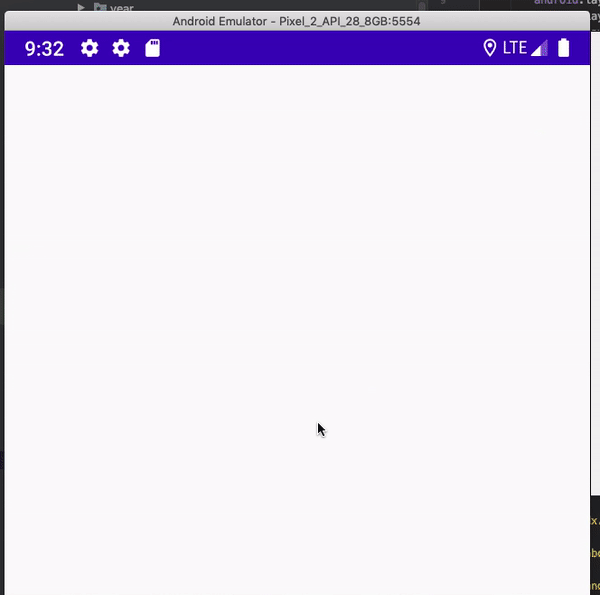

# Labelled Progress Bar

Small library which provides a labelled animating progress bar

[](https://jitpack.io/#thementalgoose/android-labelled-progress-bar)



## Installation

<details>
    <summary><code>build.gradle</code></summary>

    allprojects {
        repositories {
            ...
            maven { url 'https://jitpack.io' }
        }
    }
</details>

<details>
    <summary><code>app/build.gradle</code></summary>

    dependencies {
        implementation 'com.github.thementalgoose:android-labelled-progress-bar:1.0.6'
        // Use Jitpack version if newer
    }

Jitpack version: [](https://jitpack.io/#thementalgoose/android-labelled-progress-bar)
</details>

## Usage

```xml
<tmg.labelledprogressbar.LabelledProgressBar
    android:id="@+id/progressBar2"
    android:layout_width="match_parent"
    android:layout_height="28dp"
    android:layout_marginTop="16dp"
    app:lpb_fromLeft="true"
    app:lpb_backgroundColour="#ffffff"
    app:lpb_progressColour="#817394"
    app:lpb_textBarColour="#827204"
    app:lpb_textBackgroundColour="#000000"
    app:lpb_textPadding="6dp"
    app:lpb_textSize="14sp"
    app:lpb_timeLimit="1000"
    app:lpb_radius="6dp"
    app:lpb_sliverWidth="1dp"
    app:lpb_showSliverOnEmpty="true|false" <!-- Deprecated -->
    app:lpb_initialProgress="0.4"
    app:lpb_initialAnimate="true" />
```

By default, this view will display a percentage of the current progress that's being animated. You can override this with the "Evaluator" where you can evaluate a percentage to a specific label

```kotlin
// Category animate
labelledProgressBar.animateProgress(0.6f) { progress ->
    return when {
        it <= 0.2f -> "poor"
        it <= 0.4f -> "bad"
        it <= 0.6f -> "average"
        it <= 0.8f -> "good"
        it <= 1.0f -> "excellent"
    }
}

// Hours throughout a day
val start: Int = 0
val end: Int = 24
labelledProgressBar.animateProgress(0.7f) { progress ->
    return "${(start + ((end.toFloat() - start.toFloat()) * progress).toInt())} hours"
}
```

#### XML tags

| Tag                       | Description |
|---------------------------|-------------|
| `app:lpb_backgroundColor` | Background colour of the whole bar |
| `app:lpb_progressColour`  | Progress bar colour |
| `app:lpb_textBarColour` | Colour of the text when it's displayed on the bar and not the background |
| `app:lpb_textBackgroundColour` | Colour of the text when it's displayed on the background and not the bar |
| `app:lpb_textPadding` | Distance between the line of the bar and the start / end of the text |
| `app:lpb_textSize` | Text size of the label |
| `app:lpb_timeLimit` | Time limit in milliseconds for how long the animation should take |
| `app:lpb_radius` | Radius of the corners of the progress bar |
| `app:lpb_showSliverOnEmpty` | *Deprecated*: Please use sliverWidth instead. |
| `app:lpb_sliverWidth` | When the progress is 0f, show a little sliver of a bar to indicate something is there. Defaults to 0dp (ie. off) |
| `app:lpb_initialProgress` | Initialise the widget with a progress. Capped between 0.0f and 1.0f |
| `app:lpb_initialAnimate` | Initialise the widget with an animation. `app:lpb_initialProgress` must also be set to a value for this to take effect |
| `app:lpb_fromLeft` | Animate the bar from left to right if true, or from right to left if false. Defaults to true |